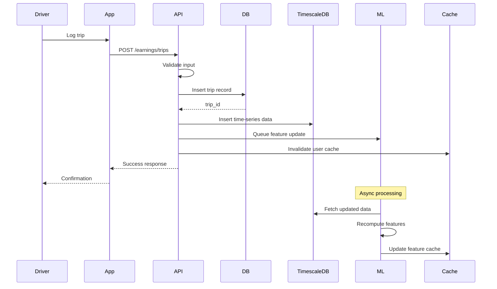
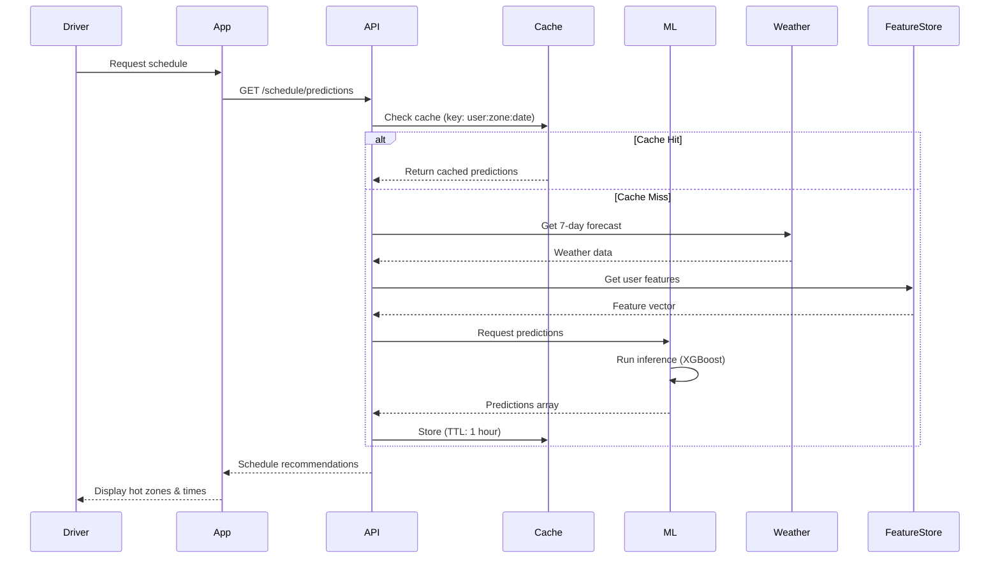

# Technical Overview - Spark Scheduler Pro

**For Developers, Architects, and Technical Stakeholders**

**Version:** 1.0
**Last Updated:** November 2, 2025

---

## Executive Summary

Spark Scheduler Pro is an AI-powered scheduling platform built with a modern, scalable architecture. This document provides a high-level technical overview for developers joining the project or stakeholders evaluating our technical approach.

---

## Technology Stack at a Glance

### Frontend
```
Mobile:        React Native 0.72+
Web:           React 18+
State:         Redux Toolkit
UI:            React Native Paper / Material-UI
Charts:        Victory Native / Chart.js
Maps:          react-native-maps
```

### Backend
```
Runtime:       Node.js 20 LTS
Framework:     Express.js 4.18+
Language:      JavaScript/TypeScript
ORM:           Sequelize 6.33+
Validation:    Joi
Auth:          Passport.js + JWT
Documentation: Swagger/OpenAPI 3.0
Testing:       Jest + Supertest
```

### Machine Learning
```
Language:      Python 3.11+
API:           FastAPI 0.104+
ML Libraries:  scikit-learn, XGBoost
Time Series:   Prophet / statsmodels
Deep Learning: TensorFlow 2.14+
Data:          Pandas, NumPy
Tracking:      MLflow
```

### Data & Infrastructure
```
Primary DB:    PostgreSQL 15+
Time Series:   TimescaleDB 2.12+
Cache:         Redis 7.2+
Storage:       AWS S3
Container:     Docker 24+
Orchestration: Kubernetes 1.28+
CI/CD:         GitHub Actions
Monitoring:    Datadog / Prometheus
```

### External Services
```
Maps:          Google Maps API / Mapbox
Calendar:      Google Calendar API
Weather:       OpenWeatherMap
Push:          Firebase Cloud Messaging
Email:         SendGrid
Payments:      Stripe
```

---

## Architecture Patterns

### 1. Microservices Architecture

The application is decomposed into loosely coupled services:

```
┌────────────────────────────────────────────┐
│           API Gateway (Kong)               │
└─────────┬──────────────────────────────────┘
          │
    ┌─────┴─────┬─────────┬─────────┬────────┐
    │           │         │         │        │
┌───▼───┐  ┌───▼───┐ ┌───▼───┐ ┌───▼───┐ ┌─▼─┐
│ Auth  │  │ User  │ │Earning│ │Sched  │ │...│
│Service│  │Service│ │Service│ │Service│ │   │
└───────┘  └───────┘ └───────┘ └───────┘ └───┘
```

**Benefits:**
- Independent scaling
- Technology flexibility
- Fault isolation
- Team autonomy

**Challenges:**
- Distributed system complexity
- Inter-service communication
- Data consistency

---

### 2. Event-Driven Architecture

**Future Enhancement - Phase 3**

```
Trips Logged → Event Bus (Kafka) → {
    - ML Feature Update
    - Analytics Aggregation
    - Notification Triggers
}
```

---

### 3. CQRS (Command Query Responsibility Segregation)

**Write Model:** Optimized for data modification
- PostgreSQL for transactional writes
- Strong consistency

**Read Model:** Optimized for queries
- TimescaleDB for time-series analytics
- Redis for frequently accessed data
- Materialized views for aggregations

---

## Data Flow Deep Dive

### Trip Logging Flow



**Key Points:**
1. **Synchronous:** Trip insert + time-series write
2. **Asynchronous:** ML feature update (via job queue)
3. **Cache Invalidation:** User-specific caches cleared
4. **Eventual Consistency:** ML features updated within minutes

---

### Schedule Prediction Flow



**Performance Targets:**
- Cache hit: <50ms
- Cache miss: <200ms
- ML inference: <100ms
- Weather API: <500ms

---

## Machine Learning Pipeline

### Training Pipeline (Daily, 2 AM)

```
┌──────────────┐
│ TimescaleDB  │
│ (Trip Data)  │
└──────┬───────┘
       │
┌──────▼────────────┐
│ Feature           │
│ Engineering       │
│ (Airflow DAG)     │
└──────┬────────────┘
       │
┌──────▼────────────┐
│ Model Training    │
│ (XGBoost)         │
└──────┬────────────┘
       │
┌──────▼────────────┐
│ Model Validation  │
│ (Test Set)        │
└──────┬────────────┘
       │
    ┌──▼──┐
    │ MAE │ < baseline?
    └──┬──┘
       │
    ┌──▼────────────┐
    │ Deploy to     │
    │ Production    │
    │ (MLflow)      │
    └───────────────┘
```

**Key Components:**

1. **Feature Engineering**
   - Temporal features (hour, day, cyclical encoding)
   - Historical aggregations (7d, 30d averages)
   - Weather features (current + forecast)
   - Zone-specific features

2. **Model Training**
   - Algorithm: XGBoost Regressor
   - Target: Earnings per hour
   - Features: ~50 engineered features
   - Training size: Last 90 days of data

3. **Validation**
   - Time-series cross-validation (5 folds)
   - Metrics: MAE, RMSE, R², MAPE
   - Acceptance criteria: MAE < $3.00, R² > 0.75

4. **Deployment**
   - Model versioning via MLflow
   - A/B testing (10% canary deployment)
   - Rollback on performance degradation

---

## Database Design Highlights

### Schema Organization

```
public schema:
  ├── users
  ├── user_zones
  ├── user_preferences
  ├── subscriptions
  └── notifications

earnings schema:
  └── trips (time-series optimized)

ml schema:
  ├── predictions
  └── user_features
```

### Key Optimizations

1. **Indexes**
   ```sql
   CREATE INDEX idx_trips_user_date ON trips(user_id, trip_date DESC);
   CREATE INDEX idx_trips_zone_date ON trips(zone_id, trip_date DESC);
   ```

2. **Partitioning** (TimescaleDB)
   ```sql
   SELECT create_hypertable('earnings_timeseries', 'time');
   ```

3. **Materialized Views**
   ```sql
   CREATE MATERIALIZED VIEW earnings_daily AS
   SELECT
       time_bucket('1 day', time) AS day,
       user_id,
       SUM(total_earnings) AS daily_earnings
   FROM earnings_timeseries
   GROUP BY day, user_id;
   ```

---

## API Design Principles

### RESTful Conventions

```
GET    /trips          - List trips
POST   /trips          - Create trip
GET    /trips/:id      - Get specific trip
PATCH  /trips/:id      - Update trip
DELETE /trips/:id      - Delete trip
```

### Response Format

**Success:**
```json
{
  "success": true,
  "data": { ... },
  "meta": {
    "timestamp": "2025-11-02T10:30:00Z",
    "requestId": "req_abc123"
  }
}
```

**Error:**
```json
{
  "success": false,
  "error": {
    "code": "VALIDATION_ERROR",
    "message": "Invalid input",
    "details": [ ... ]
  },
  "meta": { ... }
}
```

### Authentication

```
Authorization: Bearer <JWT_TOKEN>

Token Payload:
{
  "sub": "user-uuid",
  "tier": "pro",
  "exp": 1698851832
}
```

---

## Security Architecture

### Defense in Depth

```
┌─────────────────────────────────┐
│  Layer 1: Network Security      │  CloudFlare DDoS protection
├─────────────────────────────────┤
│  Layer 2: API Gateway           │  Rate limiting, WAF
├─────────────────────────────────┤
│  Layer 3: Application           │  Input validation, RBAC
├─────────────────────────────────┤
│  Layer 4: Data Layer            │  Encryption at rest
└─────────────────────────────────┘
```

### Key Security Features

1. **Authentication**
   - Bcrypt password hashing (cost: 12)
   - JWT with 24-hour expiry
   - Session management in Redis

2. **Authorization**
   - Role-based access control (Free, Pro, Admin)
   - Resource ownership validation
   - Permission checks on all endpoints

3. **Data Protection**
   - TLS 1.3 for all communications
   - AES-256 encryption at rest
   - Field-level encryption for PII

4. **API Security**
   - Input validation (Joi schemas)
   - Parameterized queries (SQL injection prevention)
   - XSS protection (sanitization + CSP headers)
   - Rate limiting (100 req/min per user)

---

## Scalability Strategy

### Horizontal Scaling

**Application Tier:**
- Stateless API services
- Auto-scaling based on CPU/memory (target: 70%)
- Load balancing across instances

**Data Tier:**
- PostgreSQL read replicas for analytics
- Redis cluster with sharding
- TimescaleDB compression for old data

**ML Tier:**
- Separate prediction and training infrastructure
- GPU instances for training (on-demand)
- CPU instances for inference (always on)

### Performance Targets

| Metric | Target | Current |
|--------|--------|---------|
| API Response Time (p95) | <200ms | TBD |
| Database Query Time (p95) | <50ms | TBD |
| ML Prediction Latency | <100ms | TBD |
| Cache Hit Rate | >90% | TBD |
| Uptime | 99.9% | TBD |

---

## Deployment Architecture

### Development
```
Docker Compose
├── PostgreSQL
├── Redis
├── TimescaleDB
├── API services
└── ML service
```

### Staging
```
AWS (Single Region)
├── EC2 Auto Scaling Group
├── RDS PostgreSQL (Multi-AZ)
├── ElastiCache Redis
└── S3
```

### Production
```
AWS (Multi-Region)
├── Route 53 (DNS)
├── CloudFront (CDN)
├── ALB (Load Balancer)
├── ECS Fargate (Containers)
│   ├── API services (4-20 tasks)
│   └── ML services (GPU)
├── Aurora PostgreSQL (Multi-AZ + Replicas)
├── ElastiCache Redis (Cluster)
└── S3 (Multi-region)
```

### CI/CD Pipeline

```
Git Push → GitHub Actions → {
    1. Lint & Test
    2. Build Docker Images
    3. Push to ECR
    4. Deploy to Staging
    5. Integration Tests
    6. [Manual Approval]
    7. Blue/Green Deploy to Production
    8. Health Checks
    9. Route Traffic
}
```

---

## Monitoring & Observability

### Metrics (Datadog)
- Application: Request rate, latency, error rate
- Infrastructure: CPU, memory, disk usage
- Database: Query performance, connections
- ML: Prediction accuracy, model drift

### Logging (CloudWatch)
- Structured JSON logs
- Request/response logging
- Error tracking with Sentry
- Audit logs (security events)

### Alerts
- Error rate >1%
- API latency >500ms (p95)
- Database CPU >80%
- ML model accuracy drop >5%
- Disk usage >85%

---

## Testing Strategy

### Test Pyramid

```
       ┌────────┐
       │  E2E   │  (10% - Critical user flows)
       └────────┘
     ┌────────────┐
     │Integration │  (30% - API contracts)
     └────────────┘
   ┌──────────────────┐
   │  Unit Tests      │  (60% - Business logic)
   └──────────────────┘
```

### Coverage Targets
- Unit tests: >80% coverage
- Integration tests: All API endpoints
- E2E tests: 10 critical user journeys

---

## Development Workflow

### Git Branch Strategy

```
main
  └─ release/v1.0
       └─ claude/feature-branch
            └─ feature/user-story
```

### Commit Convention
```
type(scope): subject

feat(api): Add trip import endpoint
fix(ml): Correct prediction caching logic
docs(readme): Update installation steps
```

---

## Technical Debt & Future Work

### Phase 2 Improvements
- [ ] GraphQL API alongside REST
- [ ] Real-time WebSocket connections
- [ ] Event-driven architecture (Kafka)
- [ ] Service mesh (Istio)

### Phase 3 Enhancements
- [ ] Multi-region deployment
- [ ] Elasticsearch for advanced search
- [ ] Advanced ML (reinforcement learning)
- [ ] Edge computing for predictions

---

## Getting Started (For Developers)

### 1. Clone & Setup
```bash
git clone https://github.com/SpacePlushy/Sparkscheduler.git
cd Sparkscheduler
npm install
cp .env.example .env
```

### 2. Read Documentation
- Start with [PRD](PRD.md) to understand the product
- Review [System Architecture](architecture/SYSTEM_ARCHITECTURE.md)
- Check [API Specification](api/API_SPECIFICATION.md)
- Study [Database Schema](database/SCHEMA.md)

### 3. Local Development
```bash
docker-compose up -d  # Start databases
npm run migrate       # Run migrations
npm run dev           # Start dev server
```

### 4. Contribute
- Pick a task from project board
- Create feature branch
- Write tests
- Submit PR with documentation

---

## Questions?

For technical questions:
- **Architecture:** See [SYSTEM_ARCHITECTURE.md](architecture/SYSTEM_ARCHITECTURE.md)
- **API:** See [API_SPECIFICATION.md](api/API_SPECIFICATION.md)
- **Database:** See [SCHEMA.md](database/SCHEMA.md)
- **ML:** See [ML_ARCHITECTURE.md](ml/ML_ARCHITECTURE.md)

For support:
- Email: tech@sparkschedulerpro.com
- GitHub Issues: [Report here](https://github.com/SpacePlushy/Sparkscheduler/issues)

---

**Document Owner:** Engineering Team
**Last Updated:** November 2, 2025
