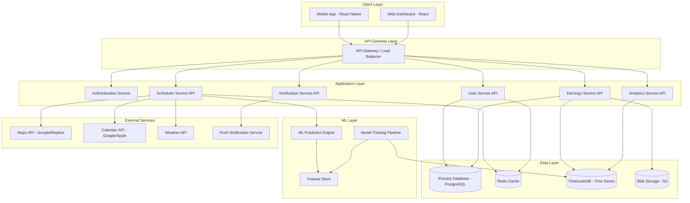
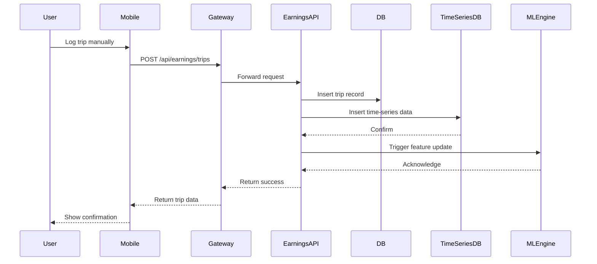
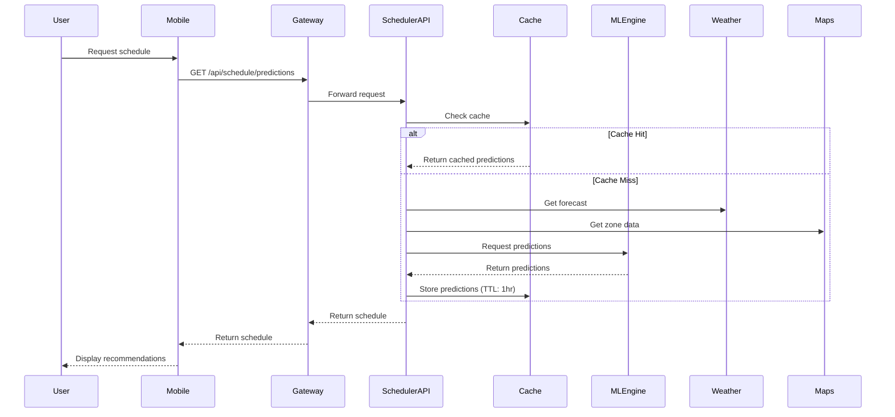
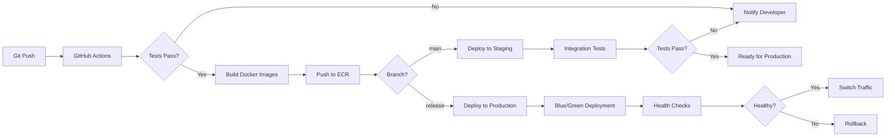

# System Architecture - Spark Scheduler Pro

**Version:** 1.0
**Last Updated:** November 2, 2025

---

## Table of Contents

1. [High-Level Architecture](#high-level-architecture)
2. [Component Overview](#component-overview)
3. [Data Flow](#data-flow)
4. [Technology Stack](#technology-stack)
5. [Deployment Architecture](#deployment-architecture)
6. [Scalability Considerations](#scalability-considerations)

---

## High-Level Architecture



---

## Component Overview

### 1. Client Layer

#### Mobile Application (React Native)
- **Purpose:** Primary user interface for drivers
- **Key Features:**
  - Dashboard with earnings overview
  - Real-time schedule recommendations
  - Manual trip logging
  - Push notification handling
  - Offline mode support
- **Technology:** React Native, Redux for state management, AsyncStorage for offline data
- **Platforms:** iOS and Android

#### Web Dashboard (React)
- **Purpose:** Desktop analytics and advanced reporting
- **Key Features:**
  - Detailed historical analysis
  - Advanced heatmap visualizations
  - CSV export functionality
  - Account management
- **Technology:** React, Redux, Chart.js/D3.js for visualizations

### 2. API Gateway Layer

#### API Gateway
- **Purpose:** Single entry point for all client requests
- **Responsibilities:**
  - Request routing
  - Rate limiting
  - API versioning
  - Request/response transformation
  - SSL termination
- **Technology:** AWS API Gateway or Kong
- **Features:**
  - JWT token validation
  - Request throttling (1000 req/min per user)
  - CORS handling
  - API analytics

### 3. Application Layer

All services built with Node.js + Express, following microservices architecture.

#### Authentication Service
- **Endpoints:** `/auth/*`
- **Responsibilities:**
  - User registration and login
  - JWT token generation and validation
  - Password reset flows
  - OAuth integration (Google, Apple)
- **Database:** PostgreSQL (users table)
- **Security:** bcrypt password hashing, JWT with 24hr expiry

#### User Service API
- **Endpoints:** `/api/users/*`
- **Responsibilities:**
  - Profile management
  - Preferences and settings
  - Multi-zone configuration
  - Subscription tier management
- **Database:** PostgreSQL
- **Caching:** Redis for frequently accessed profiles

#### Earnings Service API
- **Endpoints:** `/api/earnings/*`
- **Responsibilities:**
  - Trip logging (manual and CSV upload)
  - Earnings calculations
  - Historical data retrieval
  - Earnings aggregation by time/zone
- **Database:** PostgreSQL + TimescaleDB
- **Storage:** S3 for CSV uploads

#### Scheduler Service API
- **Endpoints:** `/api/schedule/*`
- **Responsibilities:**
  - Generate optimized schedules
  - Fetch ML predictions
  - Calendar integration
  - Real-time incentive tracking
- **Dependencies:** ML Engine, Weather API, Maps API
- **Caching:** Redis for prediction results (TTL: 1 hour)

#### Notification Service API
- **Endpoints:** `/api/notifications/*`
- **Responsibilities:**
  - Push notification delivery
  - Alert preferences management
  - Notification history
  - Spike detection alerts
- **Technology:** Firebase Cloud Messaging (FCM) / APNs
- **Queue:** Redis for notification queuing

#### Analytics Service API
- **Endpoints:** `/api/analytics/*`
- **Responsibilities:**
  - Generate weekly reports
  - Heatmap data generation
  - Performance metrics calculation
  - Community benchmarks (anonymized)
- **Database:** TimescaleDB for time-series queries
- **Optimization:** Pre-computed aggregations

### 4. ML Layer

#### ML Prediction Engine
- **Purpose:** Real-time predictions for optimal drive times
- **Input Features:**
  - Historical earnings by hour/day/zone
  - Weather conditions
  - Day of week, holidays
  - Incentive patterns
  - User-specific performance data
- **Models:**
  - Time-series forecasting (Prophet/LSTM)
  - Regression models for earnings prediction
  - Classification for "hot zone" detection
- **Technology:** Python (FastAPI), TensorFlow/PyTorch, scikit-learn
- **Deployment:** Containerized (Docker), served via REST API
- **Performance:** <200ms prediction latency

#### Model Training Pipeline
- **Purpose:** Periodic retraining of ML models
- **Schedule:** Daily batch jobs at 2 AM
- **Process:**
  1. Extract features from TimescaleDB
  2. Train/update models
  3. Validate against test set
  4. Deploy if accuracy improves >2%
- **Technology:** Apache Airflow for orchestration
- **Storage:** Model artifacts in S3, versioned

#### Feature Store
- **Purpose:** Centralized repository for ML features
- **Features Stored:**
  - Aggregated earnings by zone/time
  - Weather patterns
  - Incentive frequency
  - User behavior patterns
- **Technology:** Redis + PostgreSQL
- **Update Frequency:** Real-time updates via event streaming

### 5. Data Layer

#### Primary Database (PostgreSQL)
- **Purpose:** Core application data
- **Tables:**
  - users
  - user_zones
  - trips
  - incentives
  - subscriptions
  - notifications
- **Version:** PostgreSQL 15
- **Backup:** Automated daily backups with 30-day retention

#### Cache (Redis)
- **Purpose:** High-performance caching and session storage
- **Use Cases:**
  - User session data
  - API response caching
  - Rate limiting counters
  - Notification queue
  - ML prediction cache
- **Configuration:** Redis Cluster with replication

#### Time-Series Database (TimescaleDB)
- **Purpose:** Efficient storage and querying of time-series data
- **Data Stored:**
  - Earnings by timestamp
  - Trip metrics over time
  - Zone performance history
  - Weather data
- **Optimization:** Automatic data retention policy (2 years)

#### Blob Storage (AWS S3)
- **Purpose:** File storage
- **Contents:**
  - CSV uploads
  - ML model artifacts
  - User exports
  - Backup archives
- **Security:** Server-side encryption, pre-signed URLs for uploads

---

## Data Flow

### Earnings Logging Flow



### Schedule Prediction Flow



---

## Technology Stack

### Frontend
| Component | Technology | Version |
|-----------|------------|---------|
| Mobile Framework | React Native | 0.72+ |
| Web Framework | React | 18+ |
| State Management | Redux Toolkit | 2.0+ |
| UI Components | React Native Paper / Material-UI | Latest |
| Charts | Victory Native / Chart.js | Latest |
| Maps | react-native-maps | 1.7+ |
| HTTP Client | Axios | 1.5+ |
| Storage | AsyncStorage / localStorage | - |

### Backend
| Component | Technology | Version |
|-----------|------------|---------|
| Runtime | Node.js | 20 LTS |
| Framework | Express.js | 4.18+ |
| Authentication | Passport.js + JWT | Latest |
| Validation | Joi | 17+ |
| ORM | Sequelize | 6.33+ |
| API Documentation | Swagger/OpenAPI | 3.0 |
| Testing | Jest + Supertest | Latest |

### Machine Learning
| Component | Technology | Version |
|-----------|------------|---------|
| Language | Python | 3.11+ |
| Web Framework | FastAPI | 0.104+ |
| ML Library | scikit-learn | 1.3+ |
| Deep Learning | TensorFlow | 2.14+ |
| Time Series | Prophet / statsmodels | Latest |
| Data Processing | Pandas + NumPy | Latest |
| Model Serving | TensorFlow Serving | Latest |

### Data & Infrastructure
| Component | Technology | Version |
|-----------|------------|---------|
| Primary DB | PostgreSQL | 15+ |
| Time-Series DB | TimescaleDB | 2.12+ |
| Cache | Redis | 7.2+ |
| Object Storage | AWS S3 | - |
| Container | Docker | 24+ |
| Orchestration | Kubernetes | 1.28+ |
| CI/CD | GitHub Actions | - |
| Monitoring | Datadog / Prometheus | - |

### External APIs
| Service | Provider | Purpose |
|---------|----------|---------|
| Maps | Google Maps API | Zone mapping, distance calculation |
| Calendar | Google Calendar API | Calendar sync |
| Weather | OpenWeatherMap | Weather forecasting |
| Push Notifications | Firebase FCM | Push notifications |
| Email | SendGrid | Transactional emails |

---

## Deployment Architecture

### Development Environment
```
Local Development
├── Docker Compose
│   ├── PostgreSQL container
│   ├── Redis container
│   ├── TimescaleDB container
│   └── API services containers
├── React Native Metro bundler
└── ML services (local Python environment)
```

### Staging Environment
```
AWS Cloud
├── EC2 instances (Auto Scaling Group)
│   ├── API Gateway (2 instances)
│   ├── Application services (4 instances)
│   └── ML services (2 GPU instances)
├── RDS PostgreSQL (Multi-AZ)
├── ElastiCache Redis (Clustered)
├── S3 buckets
└── CloudFront CDN
```

### Production Environment
```
AWS Cloud (Multi-Region)
├── Route 53 (DNS + Health checks)
├── CloudFront (CDN)
├── Application Load Balancer
├── ECS Fargate (Containerized services)
│   ├── API services (Auto-scaling 4-20 tasks)
│   ├── ML services (GPU-enabled instances)
│   └── Background workers
├── RDS Aurora PostgreSQL (Multi-AZ + Read Replicas)
├── ElastiCache Redis (Cluster mode)
├── S3 (Multi-region replication)
├── CloudWatch (Monitoring & Logs)
└── AWS Backup (Automated backups)
```

### CI/CD Pipeline


---

## Scalability Considerations

### Horizontal Scaling
- **API Services:** Auto-scaling based on CPU/memory usage (target: 70% CPU)
- **Database:** Read replicas for analytics queries
- **ML Services:** Separate prediction and training infrastructure
- **Cache:** Redis cluster with sharding

### Performance Optimization
- **API Response Time:** Target <200ms for 95th percentile
- **Database Queries:** Indexed on frequently queried columns
- **Caching Strategy:**
  - User profiles: 1-hour TTL
  - ML predictions: 1-hour TTL
  - Static data: 24-hour TTL
- **CDN:** Static assets served via CloudFront

### Data Retention
- **Hot Data:** Last 90 days in primary DB
- **Warm Data:** 90 days - 1 year in TimescaleDB
- **Cold Data:** >1 year archived to S3 Glacier
- **Backups:** 30-day retention for databases

### Monitoring & Alerting
- **Application Metrics:**
  - Request rate, latency, error rate
  - User activity and engagement
  - API endpoint performance
- **Infrastructure Metrics:**
  - CPU, memory, disk usage
  - Database connections and query performance
  - Cache hit/miss rates
- **Alerts:**
  - Error rate >1%
  - API latency >500ms
  - Database CPU >80%
  - Failed deployments

### Security & Compliance
- **Data Encryption:**
  - In transit: TLS 1.3
  - At rest: AES-256
- **Authentication:** JWT with short expiry (24 hours)
- **Authorization:** Role-based access control (RBAC)
- **PII Protection:** Encryption of sensitive user data
- **GDPR Compliance:** Data export and deletion APIs

---

## Future Architecture Enhancements

### Phase 2 (Months 3-6)
- Real-time event streaming (Apache Kafka)
- GraphQL API alongside REST
- Mobile offline-first architecture (IndexedDB sync)
- Advanced ML with A/B testing framework

### Phase 3 (Months 6-12)
- Multi-region deployment for global expansion
- Elasticsearch for advanced search and analytics
- WebSocket support for real-time updates
- Microservices mesh (Istio)
- Edge computing for ultra-low latency predictions

---

**Document Owner:** Engineering Team
**Review Cycle:** Quarterly or on major architecture changes
