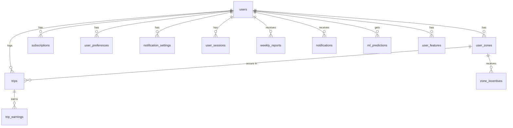

# Database Schema - Spark Scheduler Pro

**Version:** 1.0
**Database:** PostgreSQL 15 + TimescaleDB extension
**Last Updated:** November 2, 2025

---

## Table of Contents

1. [Schema Overview](#schema-overview)
2. [Primary Database Tables](#primary-database-tables)
3. [Time-Series Tables (TimescaleDB)](#time-series-tables-timescaledb)
4. [Indexes](#indexes)
5. [Relationships](#relationships)
6. [Data Models](#data-models)

---

## Schema Overview

The database is organized into three main schemas:

1. **`public`** - Core application data (users, zones, subscriptions)
2. **`earnings`** - Trip and earnings data (time-series optimized)
3. **`ml`** - Machine learning features and predictions

### ERD (Entity Relationship Diagram)



---

## Primary Database Tables

### 1. `users`

Stores core user account information.

```sql
CREATE TABLE users (
    id UUID PRIMARY KEY DEFAULT gen_random_uuid(),
    email VARCHAR(255) UNIQUE NOT NULL,
    password_hash VARCHAR(255) NOT NULL,
    first_name VARCHAR(100),
    last_name VARCHAR(100),
    phone_number VARCHAR(20),

    -- Account settings
    account_status VARCHAR(20) DEFAULT 'active' CHECK (account_status IN ('active', 'suspended', 'deleted')),
    email_verified BOOLEAN DEFAULT false,
    phone_verified BOOLEAN DEFAULT false,

    -- Location
    primary_city VARCHAR(100),
    primary_state VARCHAR(2),
    timezone VARCHAR(50) DEFAULT 'America/Phoenix',

    -- Platform integration
    spark_driver_id VARCHAR(100),

    -- Subscription
    subscription_tier VARCHAR(20) DEFAULT 'free' CHECK (subscription_tier IN ('free', 'pro')),

    -- Metadata
    created_at TIMESTAMP WITH TIME ZONE DEFAULT CURRENT_TIMESTAMP,
    updated_at TIMESTAMP WITH TIME ZONE DEFAULT CURRENT_TIMESTAMP,
    last_login_at TIMESTAMP WITH TIME ZONE,

    -- OAuth
    google_id VARCHAR(255),
    apple_id VARCHAR(255),

    CONSTRAINT valid_email CHECK (email ~* '^[A-Za-z0-9._%+-]+@[A-Za-z0-9.-]+\.[A-Z|a-z]{2,}$')
);

CREATE INDEX idx_users_email ON users(email);
CREATE INDEX idx_users_account_status ON users(account_status);
CREATE INDEX idx_users_subscription_tier ON users(subscription_tier);
```

---

### 2. `user_zones`

Stores user-defined delivery zones (multi-zone support).

```sql
CREATE TABLE user_zones (
    id UUID PRIMARY KEY DEFAULT gen_random_uuid(),
    user_id UUID NOT NULL REFERENCES users(id) ON DELETE CASCADE,

    -- Zone identification
    zone_name VARCHAR(100) NOT NULL, -- e.g., "Scottsdale - Walmart Supercenter"
    zone_type VARCHAR(50) DEFAULT 'walmart_store', -- walmart_store, custom_area

    -- Location data
    store_id VARCHAR(50), -- Walmart store ID if applicable
    address VARCHAR(255),
    city VARCHAR(100),
    state VARCHAR(2),
    zip_code VARCHAR(10),
    latitude DECIMAL(10, 8),
    longitude DECIMAL(11, 8),

    -- Zone settings
    is_primary BOOLEAN DEFAULT false,
    is_active BOOLEAN DEFAULT true,
    radius_miles DECIMAL(5, 2) DEFAULT 10.0, -- Zone radius for heatmap

    -- Metadata
    created_at TIMESTAMP WITH TIME ZONE DEFAULT CURRENT_TIMESTAMP,
    updated_at TIMESTAMP WITH TIME ZONE DEFAULT CURRENT_TIMESTAMP,

    CONSTRAINT unique_user_zone_name UNIQUE (user_id, zone_name)
);

CREATE INDEX idx_user_zones_user_id ON user_zones(user_id);
CREATE INDEX idx_user_zones_location ON user_zones USING GIST (
    ll_to_earth(latitude, longitude)
);
```

---

### 3. `trips`

Core trip data logged by users.

```sql
CREATE TABLE trips (
    id UUID PRIMARY KEY DEFAULT gen_random_uuid(),
    user_id UUID NOT NULL REFERENCES users(id) ON DELETE CASCADE,
    zone_id UUID REFERENCES user_zones(id) ON DELETE SET NULL,

    -- Trip timing
    trip_date DATE NOT NULL,
    start_time TIMESTAMP WITH TIME ZONE NOT NULL,
    end_time TIMESTAMP WITH TIME ZONE,
    duration_minutes INTEGER, -- Auto-calculated

    -- Trip type
    trip_type VARCHAR(50) DEFAULT 'delivery' CHECK (
        trip_type IN ('delivery', 'shop_and_deliver', 'express', 'dotcom')
    ),
    order_count INTEGER DEFAULT 1,

    -- Locations
    pickup_address VARCHAR(255),
    pickup_latitude DECIMAL(10, 8),
    pickup_longitude DECIMAL(11, 8),
    dropoff_address VARCHAR(255),
    dropoff_latitude DECIMAL(10, 8),
    dropoff_longitude DECIMAL(11, 8),
    distance_miles DECIMAL(6, 2),

    -- Earnings
    base_pay DECIMAL(10, 2) NOT NULL,
    tip_amount DECIMAL(10, 2) DEFAULT 0,
    incentive_amount DECIMAL(10, 2) DEFAULT 0,
    total_earnings DECIMAL(10, 2) NOT NULL, -- base + tip + incentive

    -- Conditions
    weather_condition VARCHAR(50), -- sunny, rainy, snowy, etc.
    temperature_f INTEGER,

    -- Data source
    data_source VARCHAR(20) DEFAULT 'manual' CHECK (
        data_source IN ('manual', 'csv_import', 'api')
    ),

    -- Notes
    notes TEXT,

    -- Metadata
    created_at TIMESTAMP WITH TIME ZONE DEFAULT CURRENT_TIMESTAMP,
    updated_at TIMESTAMP WITH TIME ZONE DEFAULT CURRENT_TIMESTAMP
);

CREATE INDEX idx_trips_user_id ON trips(user_id);
CREATE INDEX idx_trips_zone_id ON trips(zone_id);
CREATE INDEX idx_trips_trip_date ON trips(trip_date DESC);
CREATE INDEX idx_trips_start_time ON trips(start_time DESC);
CREATE INDEX idx_trips_user_date ON trips(user_id, trip_date DESC);
```

---

### 4. `zone_incentives`

Tracks incentives/bonuses offered for specific zones and times.

```sql
CREATE TABLE zone_incentives (
    id UUID PRIMARY KEY DEFAULT gen_random_uuid(),
    zone_id UUID REFERENCES user_zones(id) ON DELETE CASCADE,

    -- Incentive details
    incentive_type VARCHAR(50) CHECK (
        incentive_type IN ('surge', 'bonus', 'guaranteed_earnings', 'trip_bonus')
    ),
    amount DECIMAL(10, 2) NOT NULL,
    description TEXT,

    -- Timing
    valid_from TIMESTAMP WITH TIME ZONE NOT NULL,
    valid_until TIMESTAMP WITH TIME ZONE NOT NULL,

    -- Conditions
    min_trips INTEGER,
    time_window_hours INTEGER,

    -- Status
    is_active BOOLEAN DEFAULT true,

    -- Data source
    source VARCHAR(20) DEFAULT 'manual' CHECK (
        source IN ('manual', 'email_scrape', 'api')
    ),

    -- Metadata
    created_at TIMESTAMP WITH TIME ZONE DEFAULT CURRENT_TIMESTAMP,

    CONSTRAINT valid_time_range CHECK (valid_until > valid_from)
);

CREATE INDEX idx_zone_incentives_zone_id ON zone_incentives(zone_id);
CREATE INDEX idx_zone_incentives_valid_from ON zone_incentives(valid_from DESC);
CREATE INDEX idx_zone_incentives_active ON zone_incentives(is_active, valid_from);
```

---

### 5. `subscriptions`

User subscription and payment information.

```sql
CREATE TABLE subscriptions (
    id UUID PRIMARY KEY DEFAULT gen_random_uuid(),
    user_id UUID NOT NULL REFERENCES users(id) ON DELETE CASCADE,

    -- Subscription details
    tier VARCHAR(20) NOT NULL CHECK (tier IN ('free', 'pro')),
    status VARCHAR(20) DEFAULT 'active' CHECK (
        status IN ('active', 'cancelled', 'expired', 'trial')
    ),

    -- Billing
    billing_period VARCHAR(20) CHECK (billing_period IN ('monthly', 'yearly')),
    amount DECIMAL(10, 2),
    currency VARCHAR(3) DEFAULT 'USD',

    -- Payment provider
    stripe_customer_id VARCHAR(255),
    stripe_subscription_id VARCHAR(255),

    -- Dates
    trial_ends_at TIMESTAMP WITH TIME ZONE,
    current_period_start TIMESTAMP WITH TIME ZONE,
    current_period_end TIMESTAMP WITH TIME ZONE,
    cancelled_at TIMESTAMP WITH TIME ZONE,

    -- Metadata
    created_at TIMESTAMP WITH TIME ZONE DEFAULT CURRENT_TIMESTAMP,
    updated_at TIMESTAMP WITH TIME ZONE DEFAULT CURRENT_TIMESTAMP,

    CONSTRAINT one_active_subscription UNIQUE (user_id, status)
);

CREATE INDEX idx_subscriptions_user_id ON subscriptions(user_id);
CREATE INDEX idx_subscriptions_status ON subscriptions(status);
CREATE INDEX idx_subscriptions_stripe_customer ON subscriptions(stripe_customer_id);
```

---

### 6. `user_preferences`

User settings and preferences.

```sql
CREATE TABLE user_preferences (
    id UUID PRIMARY KEY DEFAULT gen_random_uuid(),
    user_id UUID NOT NULL UNIQUE REFERENCES users(id) ON DELETE CASCADE,

    -- Schedule preferences
    preferred_start_time TIME, -- e.g., 08:00
    preferred_end_time TIME,   -- e.g., 18:00
    preferred_days_of_week INTEGER[], -- [1,2,3,4,5] for Mon-Fri
    min_hourly_target DECIMAL(6, 2) DEFAULT 20.00, -- Minimum $/hour to accept

    -- Zone preferences
    max_drive_distance_miles DECIMAL(5, 2) DEFAULT 15.0,
    avoid_zones UUID[], -- Array of zone IDs to avoid

    -- Notification preferences
    enable_schedule_reminders BOOLEAN DEFAULT true,
    enable_incentive_alerts BOOLEAN DEFAULT true,
    enable_spike_alerts BOOLEAN DEFAULT true,
    quiet_hours_start TIME,
    quiet_hours_end TIME,

    -- Display preferences
    preferred_units VARCHAR(10) DEFAULT 'imperial' CHECK (preferred_units IN ('imperial', 'metric')),
    dashboard_layout JSONB DEFAULT '{"widgets": ["earnings", "schedule", "heatmap"]}',

    -- Metadata
    created_at TIMESTAMP WITH TIME ZONE DEFAULT CURRENT_TIMESTAMP,
    updated_at TIMESTAMP WITH TIME ZONE DEFAULT CURRENT_TIMESTAMP
);

CREATE INDEX idx_user_preferences_user_id ON user_preferences(user_id);
```

---

### 7. `notifications`

Push notifications and alerts sent to users.

```sql
CREATE TABLE notifications (
    id UUID PRIMARY KEY DEFAULT gen_random_uuid(),
    user_id UUID NOT NULL REFERENCES users(id) ON DELETE CASCADE,

    -- Notification details
    notification_type VARCHAR(50) NOT NULL CHECK (
        notification_type IN (
            'schedule_reminder', 'incentive_alert', 'spike_alert',
            'weekly_report', 'system_update', 'subscription_reminder'
        )
    ),
    title VARCHAR(255) NOT NULL,
    body TEXT NOT NULL,

    -- Action
    action_url VARCHAR(500), -- Deep link to app screen

    -- Delivery
    is_read BOOLEAN DEFAULT false,
    is_sent BOOLEAN DEFAULT false,
    sent_at TIMESTAMP WITH TIME ZONE,
    read_at TIMESTAMP WITH TIME ZONE,

    -- Push notification IDs
    fcm_message_id VARCHAR(255),
    apns_message_id VARCHAR(255),

    -- Priority
    priority VARCHAR(10) DEFAULT 'normal' CHECK (priority IN ('low', 'normal', 'high')),

    -- Metadata
    created_at TIMESTAMP WITH TIME ZONE DEFAULT CURRENT_TIMESTAMP
);

CREATE INDEX idx_notifications_user_id ON notifications(user_id);
CREATE INDEX idx_notifications_created_at ON notifications(created_at DESC);
CREATE INDEX idx_notifications_is_read ON notifications(user_id, is_read);
```

---

### 8. `user_sessions`

Active user sessions for authentication.

```sql
CREATE TABLE user_sessions (
    id UUID PRIMARY KEY DEFAULT gen_random_uuid(),
    user_id UUID NOT NULL REFERENCES users(id) ON DELETE CASCADE,

    -- Session info
    token_hash VARCHAR(255) NOT NULL UNIQUE,
    device_type VARCHAR(20) CHECK (device_type IN ('ios', 'android', 'web')),
    device_id VARCHAR(255),
    device_name VARCHAR(100),

    -- IP and location
    ip_address INET,
    user_agent TEXT,

    -- Expiry
    expires_at TIMESTAMP WITH TIME ZONE NOT NULL,
    last_activity_at TIMESTAMP WITH TIME ZONE DEFAULT CURRENT_TIMESTAMP,

    -- Status
    is_active BOOLEAN DEFAULT true,

    -- Metadata
    created_at TIMESTAMP WITH TIME ZONE DEFAULT CURRENT_TIMESTAMP,

    CONSTRAINT valid_expiry CHECK (expires_at > created_at)
);

CREATE INDEX idx_user_sessions_user_id ON user_sessions(user_id);
CREATE INDEX idx_user_sessions_token_hash ON user_sessions(token_hash);
CREATE INDEX idx_user_sessions_expires_at ON user_sessions(expires_at);
```

---

## Time-Series Tables (TimescaleDB)

These tables use TimescaleDB's hypertable feature for efficient time-series data storage and querying.

### 9. `earnings_timeseries`

Aggregated earnings data optimized for analytics.

```sql
CREATE TABLE earnings_timeseries (
    time TIMESTAMP WITH TIME ZONE NOT NULL,
    user_id UUID NOT NULL REFERENCES users(id) ON DELETE CASCADE,
    zone_id UUID REFERENCES user_zones(id) ON DELETE SET NULL,

    -- Aggregated metrics
    total_earnings DECIMAL(10, 2) NOT NULL,
    total_trips INTEGER NOT NULL,
    total_miles DECIMAL(8, 2),
    total_duration_minutes INTEGER,

    -- Calculated metrics
    earnings_per_hour DECIMAL(8, 2),
    earnings_per_mile DECIMAL(6, 2),
    avg_trip_earnings DECIMAL(8, 2),

    -- Breakdown
    base_pay_total DECIMAL(10, 2),
    tips_total DECIMAL(10, 2),
    incentives_total DECIMAL(10, 2),

    -- Context
    day_of_week INTEGER, -- 0=Sunday, 6=Saturday
    hour_of_day INTEGER, -- 0-23
    weather_condition VARCHAR(50),

    PRIMARY KEY (time, user_id, zone_id)
);

-- Convert to hypertable (TimescaleDB)
SELECT create_hypertable('earnings_timeseries', 'time');

-- Create continuous aggregate for daily rollups
CREATE MATERIALIZED VIEW earnings_daily
WITH (timescaledb.continuous) AS
SELECT
    time_bucket('1 day', time) AS day,
    user_id,
    zone_id,
    SUM(total_earnings) AS daily_earnings,
    SUM(total_trips) AS daily_trips,
    AVG(earnings_per_hour) AS avg_hourly_rate,
    SUM(total_miles) AS daily_miles
FROM earnings_timeseries
GROUP BY day, user_id, zone_id;

-- Refresh policy
SELECT add_continuous_aggregate_policy('earnings_daily',
    start_offset => INTERVAL '1 month',
    end_offset => INTERVAL '1 day',
    schedule_interval => INTERVAL '1 hour');
```

---

### 10. `weather_timeseries`

Historical weather data for correlation analysis.

```sql
CREATE TABLE weather_timeseries (
    time TIMESTAMP WITH TIME ZONE NOT NULL,
    latitude DECIMAL(10, 8) NOT NULL,
    longitude DECIMAL(11, 8) NOT NULL,

    -- Weather data
    condition VARCHAR(50), -- sunny, cloudy, rainy, snowy, etc.
    temperature_f INTEGER,
    humidity_percent INTEGER,
    precipitation_inches DECIMAL(4, 2),
    wind_speed_mph INTEGER,

    -- Source
    source VARCHAR(50) DEFAULT 'openweathermap',

    PRIMARY KEY (time, latitude, longitude)
);

SELECT create_hypertable('weather_timeseries', 'time');

CREATE INDEX idx_weather_location ON weather_timeseries(latitude, longitude, time DESC);
```

---

## Machine Learning Tables

### 11. `ml_predictions`

Stores ML model predictions for schedule optimization.

```sql
CREATE TABLE ml_predictions (
    id UUID PRIMARY KEY DEFAULT gen_random_uuid(),
    user_id UUID NOT NULL REFERENCES users(id) ON DELETE CASCADE,
    zone_id UUID REFERENCES user_zones(id) ON DELETE CASCADE,

    -- Prediction window
    prediction_date DATE NOT NULL,
    hour_of_day INTEGER NOT NULL CHECK (hour_of_day BETWEEN 0 AND 23),

    -- Predictions
    predicted_earnings_per_hour DECIMAL(8, 2) NOT NULL,
    predicted_trip_count INTEGER,
    confidence_score DECIMAL(5, 4), -- 0.0 to 1.0

    -- Classification
    is_hot_zone BOOLEAN DEFAULT false,
    demand_level VARCHAR(20) CHECK (demand_level IN ('low', 'medium', 'high', 'surge')),

    -- Model info
    model_version VARCHAR(50) NOT NULL,
    features_used JSONB,

    -- Metadata
    created_at TIMESTAMP WITH TIME ZONE DEFAULT CURRENT_TIMESTAMP,

    CONSTRAINT unique_prediction UNIQUE (user_id, zone_id, prediction_date, hour_of_day)
);

CREATE INDEX idx_ml_predictions_user_zone ON ml_predictions(user_id, zone_id);
CREATE INDEX idx_ml_predictions_date ON ml_predictions(prediction_date, hour_of_day);
```

---

### 12. `user_features`

Precomputed features for ML models (Feature Store).

```sql
CREATE TABLE user_features (
    id UUID PRIMARY KEY DEFAULT gen_random_uuid(),
    user_id UUID NOT NULL REFERENCES users(id) ON DELETE CASCADE,
    feature_date DATE NOT NULL,

    -- Historical performance features
    avg_earnings_per_hour_7d DECIMAL(8, 2),
    avg_earnings_per_hour_30d DECIMAL(8, 2),
    total_trips_7d INTEGER,
    total_trips_30d INTEGER,

    -- Behavioral features
    preferred_hours INTEGER[], -- Array of hours user typically works
    preferred_zones UUID[], -- Array of zone IDs
    avg_session_duration_minutes INTEGER,

    -- Trend features
    earnings_trend VARCHAR(20), -- increasing, decreasing, stable
    best_day_of_week INTEGER,
    best_hour_of_day INTEGER,

    -- Features as JSONB for flexibility
    additional_features JSONB,

    -- Metadata
    computed_at TIMESTAMP WITH TIME ZONE DEFAULT CURRENT_TIMESTAMP,

    CONSTRAINT unique_user_feature_date UNIQUE (user_id, feature_date)
);

CREATE INDEX idx_user_features_user_id ON user_features(user_id, feature_date DESC);
```

---

### 13. `weekly_reports`

Stores generated weekly reports for users.

```sql
CREATE TABLE weekly_reports (
    id UUID PRIMARY KEY DEFAULT gen_random_uuid(),
    user_id UUID NOT NULL REFERENCES users(id) ON DELETE CASCADE,

    -- Report period
    week_start_date DATE NOT NULL,
    week_end_date DATE NOT NULL,

    -- Summary metrics
    total_earnings DECIMAL(10, 2),
    total_trips INTEGER,
    total_hours DECIMAL(6, 2),
    total_miles DECIMAL(8, 2),
    avg_hourly_rate DECIMAL(8, 2),

    -- Best performance
    best_day DATE,
    best_zone_id UUID REFERENCES user_zones(id),
    best_hour_range VARCHAR(20), -- e.g., "5pm-7pm"

    -- Comparisons
    earnings_vs_prev_week_percent DECIMAL(6, 2),
    trips_vs_prev_week_percent DECIMAL(6, 2),

    -- Insights (generated by AI)
    insights JSONB, -- Array of insight objects
    recommendations JSONB, -- Array of recommendation objects

    -- Delivery
    emailed_at TIMESTAMP WITH TIME ZONE,
    viewed_at TIMESTAMP WITH TIME ZONE,

    -- Metadata
    created_at TIMESTAMP WITH TIME ZONE DEFAULT CURRENT_TIMESTAMP,

    CONSTRAINT unique_user_week UNIQUE (user_id, week_start_date)
);

CREATE INDEX idx_weekly_reports_user_id ON weekly_reports(user_id, week_start_date DESC);
```

---

## Indexes

### Critical Indexes Summary

```sql
-- User lookups
CREATE INDEX idx_users_email ON users(email);

-- Trip queries (most frequent)
CREATE INDEX idx_trips_user_date ON trips(user_id, trip_date DESC);
CREATE INDEX idx_trips_zone_date ON trips(zone_id, trip_date DESC);

-- Geospatial queries
CREATE INDEX idx_user_zones_location ON user_zones USING GIST (
    ll_to_earth(latitude, longitude)
);

-- Notifications
CREATE INDEX idx_notifications_unread ON notifications(user_id, is_read)
    WHERE is_read = false;

-- Session management
CREATE INDEX idx_user_sessions_active ON user_sessions(user_id, is_active, expires_at)
    WHERE is_active = true;

-- ML predictions
CREATE INDEX idx_ml_predictions_future ON ml_predictions(user_id, prediction_date)
    WHERE prediction_date >= CURRENT_DATE;
```

---

## Relationships

### One-to-Many Relationships
- `users` → `user_zones` (one user has many zones)
- `users` → `trips` (one user logs many trips)
- `users` → `notifications` (one user receives many notifications)
- `user_zones` → `trips` (one zone has many trips)
- `user_zones` → `zone_incentives` (one zone has many incentives)

### One-to-One Relationships
- `users` → `user_preferences` (one user has one preferences record)
- `users` → `subscriptions` (one user has one active subscription)

### Many-to-Many Relationships
None currently, but potential future additions:
- Users sharing zones (community zones)
- Users following other users for benchmarking

---

## Data Models

### Example JSON Structures

#### Dashboard Layout (user_preferences.dashboard_layout)
```json
{
  "widgets": [
    {
      "type": "earnings",
      "position": 1,
      "size": "large",
      "timeRange": "7d"
    },
    {
      "type": "schedule",
      "position": 2,
      "size": "medium"
    },
    {
      "type": "heatmap",
      "position": 3,
      "size": "large",
      "zoneId": "uuid-here"
    }
  ]
}
```

#### Insights (weekly_reports.insights)
```json
[
  {
    "type": "peak_performance",
    "title": "Best Time Found",
    "message": "Your highest earnings were Tuesday 5-7pm at $32/hour",
    "confidence": 0.92
  },
  {
    "type": "trend",
    "title": "Earnings Trend",
    "message": "Your hourly rate increased 18% this week",
    "change": 0.18
  }
]
```

#### ML Features (ml_predictions.features_used)
```json
{
  "temporal": {
    "day_of_week": 2,
    "hour_of_day": 17,
    "is_weekend": false,
    "is_holiday": false
  },
  "weather": {
    "condition": "sunny",
    "temperature_f": 75
  },
  "historical": {
    "avg_earnings_same_hour_7d": 28.50,
    "trip_count_same_hour_7d": 3.2
  },
  "user_specific": {
    "user_avg_hourly": 25.00,
    "user_trip_completion_rate": 0.95
  }
}
```

---

## Migration Strategy

### Initial Schema Deployment
```sql
-- Run migrations in order:
-- 1. Create extensions
CREATE EXTENSION IF NOT EXISTS "uuid-ossp";
CREATE EXTENSION IF NOT EXISTS "pgcrypto";
CREATE EXTENSION IF NOT EXISTS "timescaledb";
CREATE EXTENSION IF NOT EXISTS "earthdistance" CASCADE;

-- 2. Create schemas
CREATE SCHEMA IF NOT EXISTS public;
CREATE SCHEMA IF NOT EXISTS earnings;
CREATE SCHEMA IF NOT EXISTS ml;

-- 3. Create tables (in dependency order)
-- Run table creation scripts from this document

-- 4. Create indexes
-- Run index creation scripts

-- 5. Insert seed data (if needed)
-- Development/staging only
```

### Data Retention Policies
```sql
-- Auto-delete old notifications after 90 days
SELECT add_retention_policy('notifications', INTERVAL '90 days');

-- Compress old time-series data after 30 days
SELECT add_compression_policy('earnings_timeseries', INTERVAL '30 days');

-- Auto-delete old predictions after 7 days
SELECT add_retention_policy('ml_predictions', INTERVAL '7 days');
```

---

**Document Owner:** Database Team
**Review Cycle:** Monthly or on schema changes
