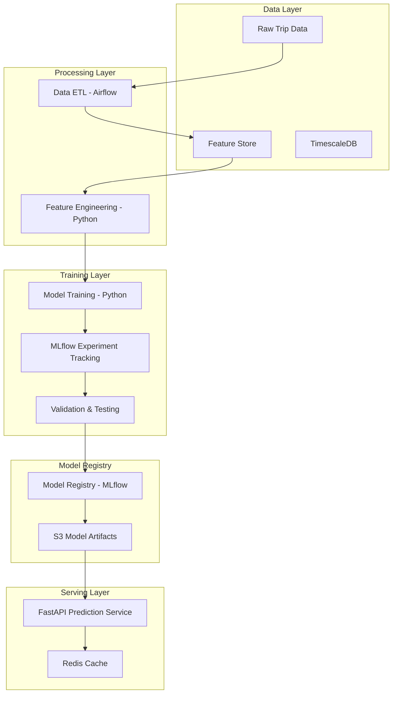
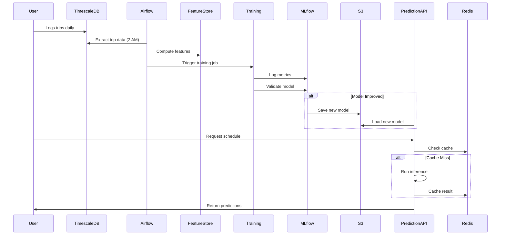

# Machine Learning Architecture - Spark Scheduler Pro

**Version:** 1.0
**Last Updated:** November 2, 2025

---

## Table of Contents

1. [Overview](#overview)
2. [Problem Statement](#problem-statement)
3. [ML Pipeline Architecture](#ml-pipeline-architecture)
4. [Feature Engineering](#feature-engineering)
5. [Model Architecture](#model-architecture)
6. [Training Pipeline](#training-pipeline)
7. [Inference Pipeline](#inference-pipeline)
8. [Model Evaluation](#model-evaluation)
9. [Deployment Strategy](#deployment-strategy)
10. [Monitoring & Retraining](#monitoring--retraining)

---

## Overview

The ML system powers the core "Smart Scheduler" feature by predicting optimal drive times for Walmart Spark drivers. The system uses a combination of time-series forecasting, regression, and classification models to generate personalized schedule recommendations.

### Key Objectives

1. **Predict hourly earnings** for each zone and time slot
2. **Identify "hot zones"** with high demand
3. **Classify demand levels** (low, medium, high, surge)
4. **Personalize recommendations** based on user performance
5. **Maintain <200ms prediction latency** for real-time inference

### ML Tech Stack



---

## Problem Statement

### Primary Prediction Task

**Input:** User ID, Zone ID, Date, Hour of Day, Weather, Historical Data

**Output:** Predicted earnings per hour, trip count, demand classification

**Challenges:**
- Limited initial user data (cold start problem)
- High variance in earnings (tips, incentives)
- Temporal patterns (day of week, seasonality)
- Weather dependencies
- User-specific performance patterns

### Solution Approach

**Hybrid Model:** Combine global patterns (all users) with user-specific patterns

1. **Global Model:** Trained on aggregated community data
2. **Personalized Model:** Fine-tuned on individual user data
3. **Ensemble:** Weighted combination based on data availability

---

## ML Pipeline Architecture

### End-to-End Flow



---

## Feature Engineering

### Feature Categories

#### 1. Temporal Features

```python
temporal_features = {
    # Date/time
    'hour_of_day': int,        # 0-23
    'day_of_week': int,        # 0=Sunday, 6=Saturday
    'day_of_month': int,       # 1-31
    'week_of_year': int,       # 1-52
    'month': int,              # 1-12

    # Special days
    'is_weekend': bool,
    'is_holiday': bool,
    'is_payday': bool,         # 1st and 15th of month

    # Cyclical encoding
    'hour_sin': float,         # sin(2π * hour / 24)
    'hour_cos': float,         # cos(2π * hour / 24)
    'day_sin': float,          # sin(2π * day / 7)
    'day_cos': float,          # cos(2π * day / 7)
}
```

#### 2. Historical Earnings Features

```python
historical_features = {
    # User-specific
    'user_avg_hourly_7d': float,
    'user_avg_hourly_30d': float,
    'user_total_trips_7d': int,
    'user_total_trips_30d': int,
    'user_completion_rate': float,

    # Zone-specific
    'zone_avg_hourly_7d': float,
    'zone_avg_hourly_30d': float,
    'zone_trip_density': float,     # trips per square mile

    # Time slot specific (same hour, same day of week)
    'same_hour_avg_earnings_4w': float,
    'same_hour_trip_count_4w': int,
    'same_day_avg_earnings_4w': float,

    # Trends
    'earnings_trend_7d': float,      # % change week over week
    'trip_count_trend_7d': float,
}
```

#### 3. Weather Features

```python
weather_features = {
    'temperature_f': float,
    'humidity_percent': float,
    'precipitation_inches': float,
    'wind_speed_mph': float,

    # Categorical
    'condition': str,               # sunny, rainy, snowy, etc.
    'condition_encoded': int,       # One-hot or label encoded

    # Derived
    'is_bad_weather': bool,         # rain/snow
    'heat_index': float,            # Feels-like temperature
}
```

#### 4. Zone Features

```python
zone_features = {
    # Location
    'latitude': float,
    'longitude': float,
    'zone_type': str,               # walmart_store, custom_area

    # Demographics (external data)
    'population_density': float,
    'median_income': float,
    'avg_tip_rate': float,          # Historical average

    # Distance
    'distance_from_user_home': float,
}
```

#### 5. Incentive Features

```python
incentive_features = {
    'active_incentives_count': int,
    'max_incentive_amount': float,
    'total_incentive_value': float,
    'incentive_type': str,          # surge, bonus, guaranteed
    'hours_since_last_incentive': float,
}
```

### Feature Store Schema

```python
# Redis-backed feature store
feature_store_key = f"features:user:{user_id}:zone:{zone_id}:date:{date}"

feature_vector = {
    'temporal': {...},
    'historical': {...},
    'weather': {...},
    'zone': {...},
    'incentives': {...},
    'metadata': {
        'computed_at': timestamp,
        'version': '1.0'
    }
}
```

### Feature Computation Pipeline

```python
# Airflow DAG: feature_computation
DAG = {
    'schedule': '@daily',
    'start_date': '2025-11-01',
    'tasks': [
        extract_trip_data(),
        extract_weather_data(),
        extract_incentive_data(),
        compute_historical_features(),
        compute_temporal_features(),
        aggregate_zone_features(),
        store_features(),
        validate_features()
    ]
}
```

---

## Model Architecture

### Model 1: Hourly Earnings Predictor (Regression)

**Objective:** Predict earnings per hour for a given zone and time

**Architecture:** Gradient Boosting Regressor (XGBoost)

```python
from xgboost import XGBRegressor

earnings_model = XGBRegressor(
    n_estimators=200,
    max_depth=6,
    learning_rate=0.05,
    subsample=0.8,
    colsample_bytree=0.8,
    objective='reg:squarederror',
    tree_method='hist',
    random_state=42
)

# Input features (50+ features)
X = [temporal, historical, weather, zone, incentives]

# Target
y = 'earnings_per_hour'
```

**Why XGBoost:**
- Handles non-linear relationships well
- Built-in feature importance
- Fast inference
- Robust to outliers
- Good performance with tabular data

**Alternatives Considered:**
- Random Forest (similar performance, slower)
- LightGBM (faster, similar accuracy)
- Neural Network (overkill for this problem size)

---

### Model 2: Trip Count Predictor (Regression)

**Objective:** Predict number of trips in an hour

**Architecture:** XGBoost Regressor (similar to Model 1)

```python
trip_count_model = XGBRegressor(
    n_estimators=150,
    max_depth=5,
    learning_rate=0.05,
    objective='count:poisson',  # Poisson for count data
    random_state=42
)

y = 'trip_count'
```

---

### Model 3: Demand Level Classifier (Classification)

**Objective:** Classify demand level (low, medium, high, surge)

**Architecture:** XGBoost Classifier

```python
from xgboost import XGBClassifier

demand_classifier = XGBClassifier(
    n_estimators=100,
    max_depth=4,
    learning_rate=0.1,
    objective='multi:softprob',
    num_class=4,
    random_state=42
)

# Target classes
y = [0, 1, 2, 3]  # low, medium, high, surge

# Thresholds based on earnings percentiles
# low: <25th percentile
# medium: 25-75th percentile
# high: 75-90th percentile
# surge: >90th percentile
```

---

### Model 4: Hot Zone Detector (Binary Classification)

**Objective:** Identify if a zone is "hot" (high demand/earnings)

**Architecture:** Logistic Regression + XGBoost Ensemble

```python
from sklearn.ensemble import VotingClassifier
from sklearn.linear_model import LogisticRegression

hot_zone_ensemble = VotingClassifier(
    estimators=[
        ('lr', LogisticRegression(C=1.0)),
        ('xgb', XGBClassifier(n_estimators=50, max_depth=3))
    ],
    voting='soft',
    weights=[0.3, 0.7]
)

# Positive class: top 20% of zones by earnings
y = is_hot_zone  # Binary: 0 or 1
```

---

### Model 5: Time-Series Forecaster (Advanced)

**Objective:** Forecast earnings trends for next 7 days

**Architecture:** Prophet (Facebook's forecasting library)

```python
from prophet import Prophet

forecaster = Prophet(
    yearly_seasonality=True,
    weekly_seasonality=True,
    daily_seasonality=False,
    changepoint_prior_scale=0.05,
    seasonality_prior_scale=10.0
)

# Input format
df = pd.DataFrame({
    'ds': dates,           # Timestamp
    'y': earnings_daily,   # Target
    'weather': weather,    # Regressor
    'incentives': incentives  # Regressor
})

forecaster.add_regressor('weather')
forecaster.add_regressor('incentives')
forecaster.fit(df)

# Predict next 7 days
future = forecaster.make_future_dataframe(periods=7)
forecast = forecaster.predict(future)
```

**Alternative:** LSTM Neural Network (if more data available)

---

## Training Pipeline

### Training Infrastructure

```yaml
Training Environment:
  Platform: AWS SageMaker / Local GPU
  Instance: ml.m5.2xlarge (CPU) or ml.p3.2xlarge (GPU for LSTM)
  Framework: Python 3.11, scikit-learn, XGBoost, Prophet
  Experiment Tracking: MLflow
  Orchestration: Apache Airflow
```

### Training DAG (Airflow)

```python
# Daily training job
@dag(
    dag_id='train_earnings_models',
    schedule='0 2 * * *',  # 2 AM daily
    start_date=datetime(2025, 11, 1),
    catchup=False
)
def train_models():

    @task
    def extract_training_data():
        """Extract last 90 days of trip data"""
        query = """
            SELECT * FROM earnings_timeseries
            WHERE time >= NOW() - INTERVAL '90 days'
        """
        return execute_query(query)

    @task
    def prepare_features(data):
        """Feature engineering"""
        features = FeatureEngineer().transform(data)
        return train_test_split(features, test_size=0.2)

    @task
    def train_earnings_model(train_data):
        """Train hourly earnings model"""
        with mlflow.start_run(run_name='earnings_predictor'):
            model = XGBRegressor(**earnings_config)
            model.fit(train_data.X, train_data.y)

            mlflow.log_params(earnings_config)
            mlflow.sklearn.log_model(model, 'model')

        return model

    @task
    def evaluate_model(model, test_data):
        """Evaluate on test set"""
        predictions = model.predict(test_data.X)

        metrics = {
            'mae': mean_absolute_error(test_data.y, predictions),
            'rmse': sqrt(mean_squared_error(test_data.y, predictions)),
            'r2': r2_score(test_data.y, predictions),
            'mape': mean_absolute_percentage_error(test_data.y, predictions)
        }

        mlflow.log_metrics(metrics)
        return metrics

    @task
    def deploy_if_improved(model, metrics):
        """Deploy to production if metrics improved"""
        current_best_rmse = get_production_metric('rmse')

        if metrics['rmse'] < current_best_rmse * 0.98:  # 2% improvement
            deploy_model(model, version='production')
            notify_team("New model deployed - RMSE improved by {:.2%}".format(
                (current_best_rmse - metrics['rmse']) / current_best_rmse
            ))

    # Define DAG flow
    data = extract_training_data()
    train_data, test_data = prepare_features(data)
    model = train_earnings_model(train_data)
    metrics = evaluate_model(model, test_data)
    deploy_if_improved(model, metrics)

dag = train_models()
```

### Hyperparameter Tuning

```python
from sklearn.model_selection import RandomizedSearchCV

param_distributions = {
    'n_estimators': [100, 150, 200, 300],
    'max_depth': [3, 4, 5, 6, 8],
    'learning_rate': [0.01, 0.05, 0.1, 0.2],
    'subsample': [0.7, 0.8, 0.9, 1.0],
    'colsample_bytree': [0.7, 0.8, 0.9, 1.0],
    'min_child_weight': [1, 3, 5],
    'gamma': [0, 0.1, 0.2]
}

search = RandomizedSearchCV(
    estimator=XGBRegressor(),
    param_distributions=param_distributions,
    n_iter=50,
    cv=5,
    scoring='neg_mean_absolute_error',
    random_state=42,
    n_jobs=-1
)

search.fit(X_train, y_train)
best_model = search.best_estimator_
```

---

## Inference Pipeline

### Prediction Service (FastAPI)

```python
from fastapi import FastAPI, HTTPException
from pydantic import BaseModel
import mlflow.pyfunc

app = FastAPI(title="Spark Scheduler ML API")

# Load model at startup
model = None

@app.on_event("startup")
async def load_model():
    global model
    model = mlflow.pyfunc.load_model("models:/earnings_predictor/production")

class PredictionRequest(BaseModel):
    user_id: str
    zone_id: str
    date: str
    hours: List[int]  # [0-23]

class PredictionResponse(BaseModel):
    predictions: List[Dict[str, float]]
    model_version: str
    confidence: float

@app.post("/predict", response_model=PredictionResponse)
async def predict_earnings(request: PredictionRequest):

    # Check cache
    cache_key = f"pred:{request.user_id}:{request.zone_id}:{request.date}"
    cached = redis_client.get(cache_key)
    if cached:
        return json.loads(cached)

    # Fetch features
    features = feature_store.get_features(
        user_id=request.user_id,
        zone_id=request.zone_id,
        date=request.date,
        hours=request.hours
    )

    # Run inference
    predictions = model.predict(features)

    # Format response
    response = {
        'predictions': [
            {
                'hour': hour,
                'predicted_earnings': pred,
                'confidence': calculate_confidence(features[i])
            }
            for i, (hour, pred) in enumerate(zip(request.hours, predictions))
        ],
        'model_version': model.metadata.version,
        'confidence': np.mean([p['confidence'] for p in response['predictions']])
    }

    # Cache for 1 hour
    redis_client.setex(cache_key, 3600, json.dumps(response))

    return response

@app.get("/health")
async def health_check():
    return {"status": "healthy", "model_loaded": model is not None}
```

### Confidence Scoring

```python
def calculate_confidence(features: dict) -> float:
    """
    Confidence based on:
    1. Data availability (user history)
    2. Feature completeness
    3. Model uncertainty (prediction variance)
    """

    # Data availability score (0-1)
    user_trips = features['user_total_trips_30d']
    data_score = min(user_trips / 50, 1.0)  # 50+ trips = full confidence

    # Feature completeness (0-1)
    missing_features = sum(1 for v in features.values() if v is None)
    completeness_score = 1.0 - (missing_features / len(features))

    # Model uncertainty (from ensemble variance)
    # Lower variance = higher confidence
    variance = model.predict_variance(features)
    uncertainty_score = 1.0 / (1.0 + variance)

    # Weighted combination
    confidence = (
        0.4 * data_score +
        0.3 * completeness_score +
        0.3 * uncertainty_score
    )

    return round(confidence, 4)
```

### Batch Prediction (for scheduled jobs)

```python
def generate_weekly_schedule(user_id: str, start_date: date):
    """
    Generate predictions for entire week at once
    More efficient than individual API calls
    """

    zones = get_user_zones(user_id)
    predictions = []

    for day in range(7):
        pred_date = start_date + timedelta(days=day)

        for zone in zones:
            # Get features for all 24 hours
            features = feature_store.get_batch_features(
                user_id=user_id,
                zone_id=zone.id,
                date=pred_date,
                hours=range(24)
            )

            # Batch predict
            earnings_pred = earnings_model.predict(features)
            trips_pred = trip_count_model.predict(features)
            demand_pred = demand_classifier.predict(features)

            # Combine results
            for hour in range(24):
                predictions.append({
                    'date': pred_date,
                    'hour': hour,
                    'zone_id': zone.id,
                    'predicted_earnings': earnings_pred[hour],
                    'predicted_trips': trips_pred[hour],
                    'demand_level': demand_pred[hour]
                })

    return predictions
```

---

## Model Evaluation

### Metrics

#### Regression Metrics (Earnings Prediction)

```python
metrics = {
    # Primary metrics
    'MAE': mean_absolute_error,        # Target: <$3.00
    'RMSE': root_mean_squared_error,   # Target: <$5.00
    'MAPE': mean_absolute_percentage_error,  # Target: <15%
    'R²': r2_score,                    # Target: >0.75

    # Business metrics
    'within_$5': lambda y_true, y_pred:
        np.mean(np.abs(y_true - y_pred) <= 5.0),  # Target: >80%

    'top_hour_accuracy': top_k_accuracy,  # Correctly identify best hour
}
```

#### Classification Metrics (Demand Level)

```python
metrics = {
    'accuracy': accuracy_score,         # Target: >0.70
    'precision': precision_score,       # Target: >0.65
    'recall': recall_score,             # Target: >0.70
    'f1': f1_score,                     # Target: >0.67
    'auc_roc': roc_auc_score,          # Target: >0.80
}

# Confusion matrix analysis
confusion_matrix(y_true, y_pred, labels=['low', 'medium', 'high', 'surge'])
```

### Validation Strategy

```python
# Time-series cross-validation
from sklearn.model_selection import TimeSeriesSplit

tscv = TimeSeriesSplit(n_splits=5)

for train_idx, test_idx in tscv.split(X):
    X_train, X_test = X[train_idx], X[test_idx]
    y_train, y_test = y[train_idx], y[test_idx]

    model.fit(X_train, y_train)
    score = model.score(X_test, y_test)
    print(f"Fold score: {score}")
```

### Feature Importance Analysis

```python
import shap

# SHAP values for model interpretability
explainer = shap.TreeExplainer(model)
shap_values = explainer.shap_values(X_test)

# Plot feature importance
shap.summary_plot(shap_values, X_test, plot_type="bar")

# Top 10 features
feature_importance = pd.DataFrame({
    'feature': feature_names,
    'importance': model.feature_importances_
}).sort_values('importance', ascending=False).head(10)
```

Expected top features:
1. `same_hour_avg_earnings_4w`
2. `hour_of_day`
3. `day_of_week`
4. `active_incentives_count`
5. `zone_avg_hourly_7d`
6. `weather_condition`
7. `is_weekend`
8. `user_avg_hourly_30d`

---

## Deployment Strategy

### Model Versioning

```python
# MLflow model registry
import mlflow

# Register model
mlflow.register_model(
    model_uri="runs:/<run_id>/model",
    name="earnings_predictor"
)

# Promote to production
client = mlflow.MlflowClient()
client.transition_model_version_stage(
    name="earnings_predictor",
    version=3,
    stage="Production"
)
```

### A/B Testing

```python
# Traffic splitting
def get_model_for_user(user_id: str):
    """
    Route 90% to production model
    Route 10% to candidate model for A/B testing
    """

    if hash(user_id) % 10 == 0:  # 10% traffic
        return mlflow.pyfunc.load_model("models:/earnings_predictor/Staging")
    else:  # 90% traffic
        return mlflow.pyfunc.load_model("models:/earnings_predictor/Production")

# Log predictions for comparison
mlflow.log_metric("model_version", version)
mlflow.log_metric("prediction", prediction)
```

### Blue/Green Deployment

```bash
# Deploy new version alongside old version
kubectl apply -f ml-service-v2-deployment.yaml

# Run canary testing
# If successful, route 100% traffic to v2
# If issues, rollback to v1

kubectl set image deployment/ml-service ml-service=ml-service:v2
```

---

## Monitoring & Retraining

### Model Performance Monitoring

```python
# Track prediction vs actual (after trip completion)
def log_prediction_accuracy(user_id, zone_id, date, hour, predicted, actual):
    """Log actual earnings vs predicted for continuous monitoring"""

    error = abs(predicted - actual)
    percentage_error = error / actual if actual > 0 else 0

    # Store in metrics table
    metrics_db.insert({
        'timestamp': datetime.now(),
        'user_id': user_id,
        'zone_id': zone_id,
        'predicted': predicted,
        'actual': actual,
        'error': error,
        'percentage_error': percentage_error,
        'model_version': current_model_version
    })

    # Alert if error exceeds threshold
    if percentage_error > 0.25:  # >25% error
        send_alert("High prediction error detected", {
            'user': user_id,
            'error': percentage_error
        })
```

### Data Drift Detection

```python
from alibi_detect.cd import TabularDrift

# Reference data (training set)
reference_data = X_train

# Detector
drift_detector = TabularDrift(
    x_ref=reference_data,
    p_val=0.05
)

# Check for drift weekly
def check_data_drift():
    recent_data = get_recent_features(days=7)
    drift_result = drift_detector.predict(recent_data)

    if drift_result['data']['is_drift']:
        send_alert("Data drift detected - retraining recommended")
        trigger_retraining_job()
```

### Automated Retraining Triggers

```python
# Retrain if:
retraining_conditions = {
    # 1. Performance degradation
    'mae_threshold': lambda: current_mae > baseline_mae * 1.1,

    # 2. Data drift detected
    'data_drift': lambda: drift_detector.predict(recent_data)['data']['is_drift'],

    # 3. Significant new data (30% increase in trip volume)
    'new_data': lambda: recent_trip_count > historical_avg * 1.3,

    # 4. Scheduled (monthly minimum)
    'scheduled': lambda: days_since_last_training >= 30
}

if any(condition() for condition in retraining_conditions.values()):
    trigger_retraining()
```

---

## Cold Start Problem

### Handling New Users (< 7 days of data)

```python
def predict_for_new_user(user_id: str, zone_id: str, date: str, hour: int):
    """
    Prediction strategy for users with limited history
    """

    user_trips = get_user_trip_count(user_id)

    if user_trips == 0:
        # Pure cold start - use zone averages
        return predict_zone_average(zone_id, date, hour)

    elif user_trips < 10:
        # Hybrid: 70% zone average, 30% user-specific
        zone_pred = predict_zone_average(zone_id, date, hour)
        user_pred = predict_user_specific(user_id, zone_id, date, hour)
        return 0.7 * zone_pred + 0.3 * user_pred

    else:
        # Sufficient data - use personalized model
        return predict_user_specific(user_id, zone_id, date, hour)
```

---

**Document Owner:** ML Team
**Review Cycle:** Monthly or on model updates
