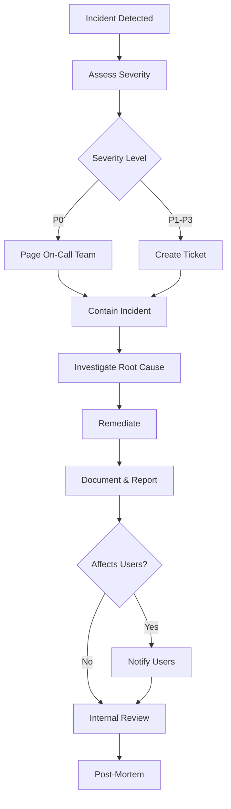

# Security & Privacy - Spark Scheduler Pro

**Version:** 1.0
**Last Updated:** November 2, 2025
**Compliance:** GDPR, CCPA, SOC 2 Type II (Target)

---

## Table of Contents

1. [Security Overview](#security-overview)
2. [Authentication & Authorization](#authentication--authorization)
3. [Data Encryption](#data-encryption)
4. [Privacy Policy](#privacy-policy)
5. [GDPR Compliance](#gdpr-compliance)
6. [Data Retention](#data-retention)
7. [Incident Response](#incident-response)
8. [Security Best Practices](#security-best-practices)
9. [Compliance Checklist](#compliance-checklist)

---

## Security Overview

Spark Scheduler Pro implements defense-in-depth security with multiple layers of protection for user data.

### Security Principles

1. **Least Privilege** - Users and services have minimum necessary permissions
2. **Defense in Depth** - Multiple security layers (network, application, data)
3. **Zero Trust** - Verify every request, assume breach
4. **Privacy by Design** - Privacy built into architecture from the start
5. **Transparency** - Clear communication about data usage

### Threat Model

| Threat | Mitigation |
|--------|------------|
| Credential theft | Bcrypt password hashing, 2FA option, session management |
| Man-in-the-middle | TLS 1.3, certificate pinning |
| SQL injection | Parameterized queries, ORM |
| XSS attacks | Input sanitization, CSP headers |
| CSRF attacks | CSRF tokens, SameSite cookies |
| DDoS attacks | Rate limiting, CloudFlare protection |
| Data breach | Encryption at rest, access logging, minimal data collection |
| Insider threats | Role-based access, audit logs |

---

## Authentication & Authorization

### Password Security

**Hashing Algorithm:** bcrypt (cost factor: 12)

```javascript
const bcrypt = require('bcrypt');

// Password hashing
async function hashPassword(plainPassword) {
    const saltRounds = 12;
    return await bcrypt.hash(plainPassword, saltRounds);
}

// Password verification
async function verifyPassword(plainPassword, hashedPassword) {
    return await bcrypt.compare(plainPassword, hashedPassword);
}
```

**Password Requirements:**
- Minimum 8 characters
- At least one uppercase letter
- At least one lowercase letter
- At least one number
- At least one special character
- Not in common password list (check against haveibeenpwned.com)

**Password Validation:**
```javascript
const passwordRegex = /^(?=.*[a-z])(?=.*[A-Z])(?=.*\d)(?=.*[@$!%*?&])[A-Za-z\d@$!%*?&]{8,}$/;

async function validatePassword(password) {
    // Check complexity
    if (!passwordRegex.test(password)) {
        throw new Error('Password does not meet complexity requirements');
    }

    // Check against breach database
    const pwned = await checkPwnedPassword(password);
    if (pwned) {
        throw new Error('This password has been compromised in a data breach');
    }

    return true;
}
```

---

### JWT Token Security

**Token Structure:**
```json
{
  "header": {
    "alg": "HS256",
    "typ": "JWT"
  },
  "payload": {
    "sub": "user-uuid",
    "email": "user@example.com",
    "tier": "pro",
    "iat": 1698765432,
    "exp": 1698851832
  }
}
```

**Token Generation:**
```javascript
const jwt = require('jsonwebtoken');

function generateToken(user) {
    const payload = {
        sub: user.id,
        email: user.email,
        tier: user.subscriptionTier,
        iat: Math.floor(Date.now() / 1000),
        exp: Math.floor(Date.now() / 1000) + (24 * 60 * 60) // 24 hours
    };

    return jwt.sign(payload, process.env.JWT_SECRET, {
        algorithm: 'HS256'
    });
}
```

**Token Verification:**
```javascript
function verifyToken(token) {
    try {
        const decoded = jwt.verify(token, process.env.JWT_SECRET, {
            algorithms: ['HS256']
        });

        // Check if user session is still active
        if (!isSessionActive(decoded.sub, token)) {
            throw new Error('Session expired or revoked');
        }

        return decoded;
    } catch (error) {
        throw new Error('Invalid token');
    }
}
```

**Token Security Best Practices:**
- Store in httpOnly cookies (web) or secure storage (mobile)
- Short expiration (24 hours)
- Refresh token rotation
- Blacklist on logout
- Include jti (JWT ID) for revocation

---

### Session Management

```javascript
// Store active sessions in Redis
async function createSession(userId, token, deviceInfo) {
    const sessionId = crypto.randomUUID();
    const tokenHash = crypto.createHash('sha256').update(token).digest('hex');

    await redis.setex(
        `session:${sessionId}`,
        86400, // 24 hours
        JSON.stringify({
            userId: userId,
            tokenHash: tokenHash,
            deviceType: deviceInfo.deviceType,
            deviceId: deviceInfo.deviceId,
            ipAddress: deviceInfo.ipAddress,
            createdAt: new Date().toISOString()
        })
    );

    // Store in PostgreSQL for persistence
    await db.userSessions.create({
        id: sessionId,
        userId: userId,
        tokenHash: tokenHash,
        deviceType: deviceInfo.deviceType,
        deviceId: deviceInfo.deviceId,
        ipAddress: deviceInfo.ipAddress,
        expiresAt: new Date(Date.now() + 86400000),
        isActive: true
    });

    return sessionId;
}

// Revoke session on logout
async function revokeSession(sessionId) {
    await redis.del(`session:${sessionId}`);
    await db.userSessions.update(
        { isActive: false },
        { where: { id: sessionId } }
    );
}
```

---

### Two-Factor Authentication (2FA)

**Future Enhancement - Phase 2**

```javascript
// TOTP-based 2FA using speakeasy
const speakeasy = require('speakeasy');

async function enable2FA(userId) {
    const secret = speakeasy.generateSecret({
        name: `Spark Scheduler Pro (${user.email})`
    });

    await db.users.update(
        {
            twoFactorSecret: secret.base32,
            twoFactorEnabled: false // Enabled after verification
        },
        { where: { id: userId } }
    );

    return {
        secret: secret.base32,
        qrCode: secret.otpauth_url
    };
}

async function verify2FA(userId, token) {
    const user = await db.users.findByPk(userId);

    const verified = speakeasy.totp.verify({
        secret: user.twoFactorSecret,
        encoding: 'base32',
        token: token,
        window: 2 // Allow 2 time steps before/after
    });

    if (verified) {
        await db.users.update(
            { twoFactorEnabled: true },
            { where: { id: userId } }
        );
    }

    return verified;
}
```

---

### Role-Based Access Control (RBAC)

```javascript
const permissions = {
    free: [
        'trips:read',
        'trips:create',
        'zones:read',
        'zones:create',
        'profile:read',
        'profile:update'
    ],
    pro: [
        ...permissions.free,
        'schedule:predict',
        'schedule:export',
        'analytics:advanced',
        'incentives:track',
        'notifications:advanced'
    ],
    admin: [
        ...permissions.pro,
        'users:read',
        'users:update',
        'users:delete',
        'system:manage'
    ]
};

function checkPermission(userTier, requiredPermission) {
    return permissions[userTier]?.includes(requiredPermission) || false;
}

// Middleware
function requirePermission(permission) {
    return (req, res, next) => {
        if (!checkPermission(req.user.tier, permission)) {
            return res.status(403).json({
                error: 'Insufficient permissions',
                required: permission,
                tier: req.user.tier
            });
        }
        next();
    };
}

// Usage
app.get('/schedule/predictions',
    authenticateJWT,
    requirePermission('schedule:predict'),
    getPredictions
);
```

---

## Data Encryption

### Encryption at Rest

**Database Encryption:**
- PostgreSQL: Transparent Data Encryption (TDE) enabled
- Redis: RDB and AOF encryption enabled
- S3: Server-side encryption (SSE-S3) with AES-256

**Sensitive Fields Encryption:**
```javascript
const crypto = require('crypto');

const ENCRYPTION_KEY = Buffer.from(process.env.ENCRYPTION_KEY, 'hex'); // 32 bytes
const ALGORITHM = 'aes-256-gcm';

function encrypt(plaintext) {
    const iv = crypto.randomBytes(16);
    const cipher = crypto.createCipheriv(ALGORITHM, ENCRYPTION_KEY, iv);

    let encrypted = cipher.update(plaintext, 'utf8', 'hex');
    encrypted += cipher.final('hex');

    const authTag = cipher.getAuthTag();

    // Return: iv:authTag:encrypted
    return `${iv.toString('hex')}:${authTag.toString('hex')}:${encrypted}`;
}

function decrypt(ciphertext) {
    const parts = ciphertext.split(':');
    const iv = Buffer.from(parts[0], 'hex');
    const authTag = Buffer.from(parts[1], 'hex');
    const encrypted = parts[2];

    const decipher = crypto.createDecipheriv(ALGORITHM, ENCRYPTION_KEY, iv);
    decipher.setAuthTag(authTag);

    let decrypted = decipher.update(encrypted, 'hex', 'utf8');
    decrypted += decipher.final('utf8');

    return decrypted;
}

// Encrypt sensitive fields before storing
async function storeUser(userData) {
    if (userData.phoneNumber) {
        userData.phoneNumber = encrypt(userData.phoneNumber);
    }

    if (userData.sparkDriverId) {
        userData.sparkDriverId = encrypt(userData.sparkDriverId);
    }

    return await db.users.create(userData);
}
```

**Fields Requiring Encryption:**
- Phone numbers
- Spark driver IDs
- OAuth refresh tokens
- Payment information (via Stripe - PCI compliant)

---

### Encryption in Transit

**TLS Configuration:**
```nginx
# Nginx SSL configuration
ssl_protocols TLSv1.3 TLSv1.2;
ssl_ciphers 'ECDHE-ECDSA-AES256-GCM-SHA384:ECDHE-RSA-AES256-GCM-SHA384';
ssl_prefer_server_ciphers on;
ssl_session_cache shared:SSL:10m;
ssl_session_timeout 10m;
ssl_stapling on;
ssl_stapling_verify on;

# HSTS header
add_header Strict-Transport-Security "max-age=31536000; includeSubDomains; preload" always;
```

**Certificate Pinning (Mobile Apps):**
```javascript
// React Native - iOS
// Add public key hashes to Info.plist
<key>NSAppTransportSecurity</key>
<dict>
    <key>NSPinnedDomains</key>
    <dict>
        <key>api.sparkschedulerpro.com</key>
        <dict>
            <key>NSIncludesSubdomains</key>
            <true/>
            <key>NSPinnedCAIdentities</key>
            <array>
                <dict>
                    <key>SPKI-SHA256-BASE64</key>
                    <string>hash-here</string>
                </dict>
            </array>
        </dict>
    </dict>
</dict>
```

---

## Privacy Policy

### Data Collection

**What We Collect:**

| Data Type | Purpose | Legal Basis | Retention |
|-----------|---------|-------------|-----------|
| Email, name | Account creation | Contract | Account lifetime |
| Phone number | Optional 2FA, notifications | Consent | Account lifetime |
| Trip data (earnings, locations) | Schedule optimization | Legitimate interest | 2 years |
| GPS location | Zone identification | Consent | 2 years |
| Device info | Push notifications | Consent | Until opt-out |
| Payment info | Subscription billing | Contract | Per PCI DSS |
| Usage analytics | App improvement | Legitimate interest | 1 year |

**What We DON'T Collect:**
- Social Security Numbers
- Driver's license information
- Bank account numbers (handled by Stripe)
- Real-time location tracking (only zone-level)
- Voice or video data
- Biometric data

---

### Data Usage

**Primary Uses:**
1. **Schedule Optimization** - ML predictions based on your trip history
2. **Analytics** - Performance tracking and insights
3. **Notifications** - Alerts for incentives and hot zones
4. **Billing** - Subscription management

**Data Sharing:**

| Recipient | Data Shared | Purpose | User Control |
|-----------|-------------|---------|--------------|
| Google Maps | Addresses, coordinates | Distance calculation | Required for service |
| OpenWeatherMap | Coordinates | Weather data | Required for predictions |
| Stripe | Email, payment method | Billing | Required for Pro tier |
| Firebase | Device token | Push notifications | Can disable in settings |
| Analytics (anonymized) | Usage patterns | Product improvement | Can opt out |

**We NEVER:**
- Sell user data to third parties
- Share personal data without consent
- Use data for advertising
- Share data with Walmart or Spark (unless required by law)

---

### User Rights

**GDPR Rights (EU users):**
1. **Right to Access** - Request copy of your data
2. **Right to Rectification** - Correct inaccurate data
3. **Right to Erasure** - Delete your account and data
4. **Right to Portability** - Export your data in CSV/JSON
5. **Right to Restrict Processing** - Limit how we use your data
6. **Right to Object** - Opt out of analytics and marketing

**CCPA Rights (California users):**
1. Know what data we collect
2. Delete your data
3. Opt out of data sales (we don't sell data)
4. Non-discrimination for exercising rights

---

## GDPR Compliance

### Data Protection by Design

```javascript
// Anonymize data for community features
function anonymizeUserData(user) {
    return {
        userId: crypto.createHash('sha256').update(user.id).digest('hex').slice(0, 16),
        city: user.primaryCity,
        state: user.primaryState,
        // No email, name, or identifying info
    };
}

// Aggregate zone performance without user identification
async function getCommunityZoneStats(zoneId) {
    const stats = await db.sequelize.query(`
        SELECT
            DATE_TRUNC('hour', start_time) AS hour,
            AVG(total_earnings) AS avg_earnings,
            COUNT(*) AS trip_count
        FROM trips
        WHERE zone_id = :zoneId
          AND trip_date >= NOW() - INTERVAL '30 days'
        GROUP BY DATE_TRUNC('hour', start_time)
        HAVING COUNT(DISTINCT user_id) >= 5  -- Only show if 5+ users
    `, {
        replacements: { zoneId: zoneId },
        type: QueryTypes.SELECT
    });

    return stats;
}
```

### Data Subject Requests (DSR)

**Data Export API:**
```javascript
// GET /users/me/export
async function exportUserData(userId) {
    const user = await db.users.findByPk(userId);
    const trips = await db.trips.findAll({ where: { userId } });
    const zones = await db.userZones.findAll({ where: { userId } });
    const preferences = await db.userPreferences.findOne({ where: { userId } });

    const exportData = {
        personal_info: {
            email: user.email,
            name: `${user.firstName} ${user.lastName}`,
            created_at: user.createdAt,
            subscription_tier: user.subscriptionTier
        },
        trips: trips.map(trip => ({
            date: trip.tripDate,
            start_time: trip.startTime,
            end_time: trip.endTime,
            zone: trip.zoneName,
            earnings: trip.totalEarnings,
            distance: trip.distanceMiles
        })),
        zones: zones.map(zone => ({
            name: zone.zoneName,
            address: zone.address
        })),
        preferences: preferences
    };

    // Generate signed S3 URL for download
    const filename = `user_data_${userId}_${Date.now()}.json`;
    const s3Url = await uploadToS3(filename, JSON.stringify(exportData, null, 2));

    return { downloadUrl: s3Url, expiresIn: '24 hours' };
}
```

**Account Deletion:**
```javascript
// DELETE /users/me
async function deleteUserAccount(userId) {
    // 1. Soft delete - mark for deletion in 30 days
    await db.users.update(
        {
            accountStatus: 'pending_deletion',
            deletionScheduledAt: new Date(Date.now() + 30 * 24 * 60 * 60 * 1000)
        },
        { where: { id: userId } }
    );

    // 2. Cancel subscription
    await cancelSubscription(userId);

    // 3. Revoke all sessions
    await revokeAllSessions(userId);

    // 4. Schedule hard delete after 30 days (background job)
    await queue.add('hard-delete-user', { userId }, { delay: 30 * 24 * 60 * 60 * 1000 });

    return {
        message: 'Account scheduled for deletion',
        deletionDate: new Date(Date.now() + 30 * 24 * 60 * 60 * 1000)
    };
}

// Background job
async function hardDeleteUser(userId) {
    // Anonymize or delete all user data
    await db.sequelize.transaction(async (transaction) => {
        await db.trips.destroy({ where: { userId }, transaction });
        await db.userZones.destroy({ where: { userId }, transaction });
        await db.userPreferences.destroy({ where: { userId }, transaction });
        await db.notifications.destroy({ where: { userId }, transaction });
        await db.userSessions.destroy({ where: { userId }, transaction });
        await db.users.destroy({ where: { id: userId }, transaction });
    });

    // Log deletion for compliance
    await auditLog.create({
        action: 'USER_DELETED',
        userId: userId,
        timestamp: new Date(),
        reason: 'User requested deletion'
    });
}
```

---

## Data Retention

### Retention Policy

| Data Type | Retention Period | Reason |
|-----------|------------------|--------|
| Active user accounts | Indefinite | User consent |
| Trip data | 2 years | ML training, analytics |
| ML predictions | 7 days | Short-term caching |
| Notifications | 90 days | User reference |
| Audit logs | 7 years | Compliance, security |
| Deleted accounts | 30 days (soft delete) | Allow recovery |
| Payment records | 7 years | Tax compliance |
| Error logs | 1 year | Debugging |

### Automated Deletion Jobs

```javascript
// Cron job: Daily at 2 AM
async function runRetentionPolicies() {
    // Delete old predictions
    await db.mlPredictions.destroy({
        where: {
            createdAt: { [Op.lt]: new Date(Date.now() - 7 * 24 * 60 * 60 * 1000) }
        }
    });

    // Delete old notifications
    await db.notifications.destroy({
        where: {
            createdAt: { [Op.lt]: new Date(Date.now() - 90 * 24 * 60 * 60 * 1000) }
        }
    });

    // Archive old trip data (move to cold storage)
    const twoYearsAgo = new Date(Date.now() - 2 * 365 * 24 * 60 * 60 * 1000);
    const oldTrips = await db.trips.findAll({
        where: { tripDate: { [Op.lt]: twoYearsAgo } }
    });

    if (oldTrips.length > 0) {
        await archiveToS3('old-trips', oldTrips);
        await db.trips.destroy({
            where: { tripDate: { [Op.lt]: twoYearsAgo } }
        });
    }
}
```

---

## Incident Response

### Security Incident Plan

**Incident Response Team:**
- **Lead:** CTO
- **Members:** Backend Lead, DevOps Lead, Legal Counsel
- **Escalation:** CEO, Board (for major breaches)

**Incident Severity Levels:**

| Level | Description | Response Time | Examples |
|-------|-------------|---------------|----------|
| P0 - Critical | Active data breach, system compromise | <15 min | Database breach, credential leak |
| P1 - High | Security vulnerability, PII exposure | <1 hour | SQL injection, XSS |
| P2 - Medium | Failed login attempts, suspicious activity | <4 hours | Brute force attempts |
| P3 - Low | Minor security issues | <24 hours | Outdated dependency |

**Response Process:**



**User Notification Template:**
```
Subject: Important Security Notice - Spark Scheduler Pro

Dear [User],

We are writing to inform you of a security incident that may have affected your account.

WHAT HAPPENED:
[Brief description of the incident]

WHAT INFORMATION WAS INVOLVED:
[List of affected data types]

WHAT WE ARE DOING:
[Steps taken to remediate]

WHAT YOU SHOULD DO:
[Recommended user actions, e.g., reset password]

We take your privacy seriously and apologize for any concern this may cause.

For questions, contact: security@sparkschedulerpro.com

Sincerely,
Spark Scheduler Pro Security Team
```

---

## Security Best Practices

### Input Validation

```javascript
const Joi = require('joi');

// Validate all API inputs
const tripSchema = Joi.object({
    zoneId: Joi.string().uuid().required(),
    tripDate: Joi.date().max('now').required(),
    startTime: Joi.date().iso().required(),
    endTime: Joi.date().iso().min(Joi.ref('startTime')).required(),
    basePay: Joi.number().min(0).max(500).required(),
    tipAmount: Joi.number().min(0).max(200).default(0),
    distanceMiles: Joi.number().min(0).max(200).required()
});

function validateInput(req, res, next) {
    const { error, value } = tripSchema.validate(req.body);

    if (error) {
        return res.status(400).json({
            error: 'Validation error',
            details: error.details.map(d => d.message)
        });
    }

    req.validatedBody = value;
    next();
}
```

### SQL Injection Prevention

```javascript
// Use parameterized queries ALWAYS
// ❌ NEVER do this
const query = `SELECT * FROM users WHERE email = '${userInput}'`;

// ✅ ALWAYS do this
const query = `SELECT * FROM users WHERE email = $1`;
await db.query(query, [userInput]);

// Or use ORM
const user = await db.users.findOne({ where: { email: userInput } });
```

### XSS Prevention

```javascript
// Sanitize HTML input
const sanitizeHtml = require('sanitize-html');

function sanitizeInput(input) {
    return sanitizeHtml(input, {
        allowedTags: [], // No HTML tags allowed
        allowedAttributes: {}
    });
}

// CSP headers
app.use((req, res, next) => {
    res.setHeader(
        'Content-Security-Policy',
        "default-src 'self'; script-src 'self'; style-src 'self' 'unsafe-inline'; img-src 'self' data: https:;"
    );
    next();
});
```

### Rate Limiting

```javascript
const rateLimit = require('express-rate-limit');

// API rate limiting
const apiLimiter = rateLimit({
    windowMs: 60 * 1000, // 1 minute
    max: 100, // 100 requests per minute
    message: 'Too many requests, please try again later',
    standardHeaders: true,
    legacyHeaders: false
});

app.use('/api/', apiLimiter);

// Stricter limit for auth endpoints
const authLimiter = rateLimit({
    windowMs: 15 * 60 * 1000, // 15 minutes
    max: 5, // 5 requests per 15 minutes
    skipSuccessfulRequests: true
});

app.use('/auth/login', authLimiter);
```

---

## Compliance Checklist

### Pre-Launch Security Audit

- [ ] **Authentication**
  - [ ] Password complexity requirements enforced
  - [ ] Bcrypt hashing with cost factor ≥12
  - [ ] JWT tokens with short expiration
  - [ ] Session management implemented

- [ ] **Authorization**
  - [ ] RBAC implemented
  - [ ] Permission checks on all protected endpoints
  - [ ] Resource ownership validation

- [ ] **Data Protection**
  - [ ] Encryption at rest (database, S3)
  - [ ] Encryption in transit (TLS 1.3)
  - [ ] Sensitive fields encrypted
  - [ ] PII minimization

- [ ] **API Security**
  - [ ] Input validation on all endpoints
  - [ ] SQL injection prevention
  - [ ] XSS prevention
  - [ ] CSRF protection
  - [ ] Rate limiting

- [ ] **Privacy Compliance**
  - [ ] Privacy policy published
  - [ ] Cookie consent banner
  - [ ] Data export API
  - [ ] Account deletion API
  - [ ] Data retention policy

- [ ] **Monitoring**
  - [ ] Audit logging enabled
  - [ ] Error monitoring (Sentry)
  - [ ] Security alerts configured
  - [ ] Incident response plan documented

- [ ] **Infrastructure**
  - [ ] Firewall rules configured
  - [ ] VPC network isolation
  - [ ] Secrets management (AWS Secrets Manager)
  - [ ] Automated backups
  - [ ] Disaster recovery plan

- [ ] **Third-Party Security**
  - [ ] Vendor security assessments
  - [ ] API key rotation policy
  - [ ] Dependency vulnerability scanning

---

**Document Owner:** Security Team
**Review Cycle:** Quarterly security audits
**Next Audit:** February 1, 2026
